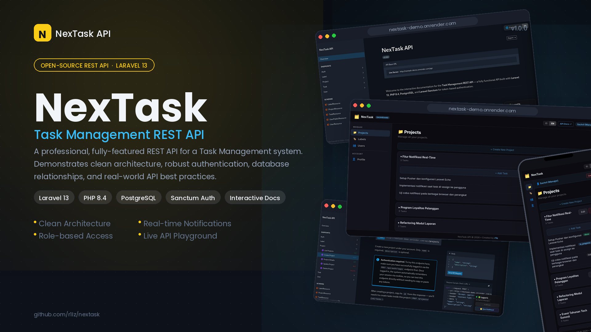

# Task Management REST API

[English](#english) | [Bahasa Indonesia](#bahasa-indonesia)

<a id="english"></a>




A professional, fully-featured REST API for a Task Management system built with Laravel 13. This project demonstrates clean architecture, robust authentication, database relationships, and API best practices.

## 🌟 Features

*   **Authentication**: Secure token-based authentication using **Laravel Sanctum**.
*   **Projects Management**: Users can create, view, update, and delete their own projects.
*   **Tasks Management**: Full CRUD for tasks within projects, including status, priority, due dates, and assignee.
*   **Labels System**: Categorize tasks using custom colored labels (Many-to-Many relationship).
*   **Authorization**: Strict Policies and Gates ensure users can only access and modify their own data.
*   **API Resources**: Consistent JSON response structures using Eloquent API Resources and pagination.
*   **Automated Testing**: Feature tests using PHPUnit to guarantee endpoint reliability.
*   **Soft Deletes**: Safe deletion of records without losing historical data.
*   **Database Seeding**: Ready-to-use factories and seeders for quick local development.

## 🚀 Getting Started

### Prerequisites

*   PHP >= 8.3
*   Composer
*   SQLite (or MySQL)

### Installation

1.  **Clone the repository**
    ```bash
    git clone https://github.com/yourusername/task-management-api.git
    cd task-management-api
    ```

2.  **Install dependencies**
    ```bash
    composer install
    ```

3.  **Environment Setup**
    ```bash
    cp .env.example .env
    php artisan key:generate
    ```
    *Note: By default, it uses SQLite. If you prefer MySQL, update the `DB_CONNECTION` in your `.env`.*

4.  **Database Migration & Seeding**
    ```bash
    touch database/database.sqlite
    php artisan migrate --seed
    ```

5.  **Run the local server**
    ```bash
    php artisan serve
    ```

## 📚 API Endpoints Documentation

We use **Scramble** to automatically generate interactive OpenAPI documentation. 

Once the server is running, simply visit:
👉 **[http://localhost:8000/docs/api](http://localhost:8000/docs/api)**

There you can view all endpoints, read explanations, and even click **"Try it out"** to test the API directly from your browser without needing Postman!

*(Below is a quick reference table. See the interactive docs for full details).*

### 🔐 Authentication

| Method | Endpoint | Description | Auth Required |
| :--- | :--- | :--- | :---: |
| `POST` | `/auth/register` | Register a new user account | ❌ |
| `POST` | `/auth/login` | Authenticate and obtain token | ❌ |
| `POST` | `/auth/logout` | Revoke current access token | ✅ |
| `GET` | `/auth/me` | Retrieve authenticated user profile (Login Status Check) | ✅ |

### 🛠️ Testing Tools (Local Only)

| Method | Endpoint | Description | Auth Required |
| :--- | :--- | :--- | :---: |
| `POST` | `/testing/reset-database` | Wipe database and re-seed (Active only when APP_ENV=local) | ❌ |

### 📁 Projects

| Method | Endpoint | Description | Auth Required |
| :--- | :--- | :--- | :---: |
| `GET` | `/projects` | Get paginated list of user's projects | ✅ |
| `POST` | `/projects` | Create a new project | ✅ |
| `GET` | `/projects/{id}` | Get specific project details | ✅ |
| `PUT` | `/projects/{id}` | Update a project | ✅ |
| `DELETE` | `/projects/{id}` | Delete a project | ✅ |

### ✅ Tasks (Nested under Projects)

| Method | Endpoint | Description | Auth Required |
| :--- | :--- | :--- | :---: |
| `GET` | `/projects/{id}/tasks` | Get paginated list of tasks in a project | ✅ |
| `POST` | `/projects/{id}/tasks` | Create a new task in a project | ✅ |
| `GET` | `/tasks/{id}` | Get specific task details | ✅ |
| `PUT` | `/tasks/{id}` | Update task (status, assignee, etc) | ✅ |
| `DELETE` | `/tasks/{id}` | Delete a task | ✅ |

### 🏷️ Labels

| Method | Endpoint | Description | Auth Required |
| :--- | :--- | :--- | :---: |
| `GET` | `/labels` | List user's custom labels | ✅ |
| `POST` | `/labels` | Create a new label | ✅ |
| `DELETE` | `/labels/{id}` | Delete a label | ✅ |

---

## 🧪 Testing

Run the test suite using PHPUnit to verify functionality:

```bash
php artisan test
```

## ⚠️ Important Note on Production Deployments

By default, the **Scramble API Documentation (`/docs/api`) is completely disabled in production** to protect your API definitions. 
If you deploy this project to a server and set `APP_ENV=production` in your `.env` file, anyone trying to access `/docs/api` will receive a `403 Forbidden` error.

If you intentionally want to make the documentation public in production (e.g., for a portfolio showcase), you must update the `Gate` definition inside `app/Providers/AppServiceProvider.php` (or wherever you define authorization logic for Scramble) by allowing it explicitly. Check the [official Scramble docs](https://scramble.dedoc.co/usage/access) for how to define the `viewApiDocs` gate.

---
## 🛠️ Built With

*   [Laravel 13](https://laravel.com/) - The PHP Framework for Web Artisans
*   [Laravel Sanctum](https://laravel.com/docs/sanctum) - Featherweight authentication
*   [PHPUnit](https://phpunit.de/) - Programmer-oriented testing framework


---
<a id="bahasa-indonesia"></a>
# 🇮🇩 BAHASA INDONESIA

API REST yang profesional dan berfitur lengkap untuk sistem Manajemen Tugas (Task Management) yang dibangun dengan Laravel 13. Proyek ini mendemonstrasikan arsitektur yang bersih, autentikasi yang kuat, relasi database, dan praktik terbaik API.

## 🌟 Fitur Utama

*   **Autentikasi**: Autentikasi berbasis token yang aman menggunakan **Laravel Sanctum**.
*   **Manajemen Proyek**: Pengguna dapat membuat, melihat, memperbarui, dan menghapus proyek mereka sendiri.
*   **Manajemen Tugas**: CRUD penuh untuk tugas di dalam proyek, termasuk status, prioritas, tenggat waktu, dan penerima tugas (assignee).
*   **Sistem Label**: Mengkategorikan tugas menggunakan label warna kustom (Relasi Many-to-Many).
*   **Otorisasi**: Policies dan Gates yang ketat memastikan pengguna hanya dapat mengakses dan memodifikasi data mereka sendiri.
*   **API Resources**: Struktur respons JSON yang konsisten menggunakan Eloquent API Resources dan paginasi.
*   **Automated Testing**: Feature tests menggunakan PHPUnit untuk menjamin keandalan endpoint.
*   **Soft Deletes**: Penghapusan data yang aman tanpa kehilangan riwayat data.
*   **Database Seeding**: Factories dan seeders yang siap pakai untuk pengembangan lokal yang cepat.

## 🚀 Memulai

### Prasyarat

*   PHP >= 8.3
*   Composer
*   SQLite (atau MySQL)

### Instalasi

1.  **Clone repositori**
    ```bash
    git clone https://github.com/r1lz/nextask.git
    cd nextask
    ```

2.  **Install dependensi**
    ```bash
    composer install
    ```

3.  **Pengaturan Environment**
    ```bash
    cp .env.example .env
    php artisan key:generate
    ```
    *Catatan: Secara default menggunakan SQLite. Jika Anda lebih suka MySQL, perbarui `DB_CONNECTION` di `.env` Anda.*

4.  **Database Migration & Seeding**
    ```bash
    touch database/database.sqlite
    php artisan migrate --seed
    ```

5.  **Jalankan server lokal**
    ```bash
    php artisan serve
    ```

## 📚 Dokumentasi Endpoint API

Kami menggunakan **Scramble** untuk secara otomatis menghasilkan dokumentasi OpenAPI interaktif.

Setelah server berjalan, cukup kunjungi:
👉 **[http://localhost:8000/docs/api](http://localhost:8000/docs/api)**

Di sana Anda dapat melihat semua endpoint, membaca penjelasan, dan bahkan mengklik **"Try it out"** untuk menguji API langsung dari browser Anda tanpa memerlukan Postman!

*(Di bawah ini adalah tabel referensi cepat. Lihat dokumentasi interaktif untuk detail lengkap).*

### 🔐 Autentikasi

| Method | Endpoint | Deskripsi | Butuh Auth |
| :--- | :--- | :--- | :---: |
| `POST` | `/auth/register` | Mendaftarkan akun pengguna baru | ❌ |
| `POST` | `/auth/login` | Autentikasi dan dapatkan token | ❌ |
| `POST` | `/auth/logout` | Mencabut token akses saat ini | ✅ |
| `GET` | `/auth/me` | Mengambil profil pengguna terautentikasi (Cek Status Login) | ✅ |

### 🛠️ Alat Pengujian (Hanya Lokal)

| Method | Endpoint | Deskripsi | Butuh Auth |
| :--- | :--- | :--- | :---: |
| `POST` | `/testing/reset-database` | Hapus database dan re-seed (Aktif hanya saat APP_ENV=local) | ❌ |

### 📁 Proyek

| Method | Endpoint | Deskripsi | Butuh Auth |
| :--- | :--- | :--- | :---: |
| `GET` | `/projects` | Dapatkan daftar proyek pengguna dengan paginasi | ✅ |
| `POST` | `/projects` | Buat proyek baru | ✅ |
| `GET` | `/projects/{id}` | Dapatkan detail proyek spesifik | ✅ |
| `PUT` | `/projects/{id}` | Perbarui proyek | ✅ |
| `DELETE` | `/projects/{id}` | Hapus proyek | ✅ |

### ✅ Tugas (Di dalam Proyek)

| Method | Endpoint | Deskripsi | Butuh Auth |
| :--- | :--- | :--- | :---: |
| `GET` | `/projects/{id}/tasks` | Dapatkan daftar tugas di dalam proyek dengan paginasi | ✅ |
| `POST` | `/projects/{id}/tasks` | Buat tugas baru di dalam proyek | ✅ |
| `GET` | `/tasks/{id}` | Dapatkan detail tugas spesifik | ✅ |
| `PUT` | `/tasks/{id}` | Perbarui tugas (status, assignee, dll) | ✅ |
| `DELETE` | `/tasks/{id}` | Hapus tugas | ✅ |

### 🏷️ Label

| Method | Endpoint | Deskripsi | Butuh Auth |
| :--- | :--- | :--- | :---: |
| `GET` | `/labels` | Daftarkan label kustom pengguna | ✅ |
| `POST` | `/labels` | Buat label baru | ✅ |
| `DELETE` | `/labels/{id}` | Hapus label | ✅ |

---

## 🧪 Pengujian

Jalankan serangkaian pengujian menggunakan PHPUnit untuk memverifikasi fungsionalitas:

```bash
php artisan test
```

## ⚠️ Catatan Penting untuk Deployment Produksi

Secara default, **Dokumentasi API Scramble (`/docs/api`) dinonaktifkan sepenuhnya di production** untuk melindungi definisi API Anda.
Jika Anda men-deploy proyek ini ke server dan mengatur `APP_ENV=production` di file `.env` Anda, siapa pun yang mencoba mengakses `/docs/api` akan menerima error `403 Forbidden`.

Jika Anda sengaja ingin membuat dokumentasi tersebut menjadi publik di production (misalnya, untuk portofolio), Anda harus memperbarui definisi `Gate` di dalam `app/Providers/AppServiceProvider.php` (atau di mana pun Anda mendefinisikan logika otorisasi untuk Scramble) dengan mengizinkannya secara eksplisit. Cek [dokumentasi resmi Scramble](https://scramble.dedoc.co/usage/access) untuk mengetahui cara mendefinisikan gate `viewApiDocs`.

---
## 🛠️ Dibangun Dengan

*   [Laravel 13](https://laravel.com/) - Kerangka Kerja PHP untuk Web Artisans
*   [Laravel Sanctum](https://laravel.com/docs/sanctum) - Autentikasi yang ringan
*   [PHPUnit](https://phpunit.de/) - Framework pengujian berorientasi programmer


